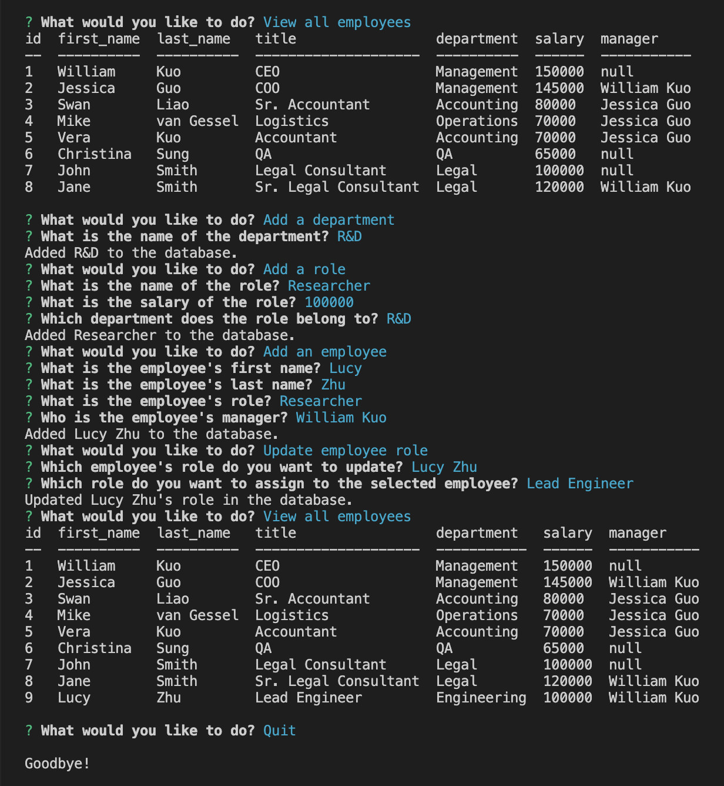

# Employee Tracker 

## Description
This command-line application help to manage a company's employee database, using Node.js, Inquirer and MySQL.

## Table of Contents
- [Installation](#installation)
- [Usage](#usage)
- [Link](#link)
- [Contribute](#contribute)

- [Questions](#questions)

## Installation
MUST HAVE MYSQL INSTALLED. Log into MySQL and execute schema.sql under /db folder. Run "npm i" in Integrated Terminal to install all dependencies. To run the application, run "node index" in Integrated Terminal.

## Usage
This application helps company/HR to track employees.

## Link:
[Employee Tracker Walkthorugh Video](https://drive.google.com/file/d/1ZhkW_P7ea1_3uIftbzZxsRhaNrGFwr5z/view?usp=sharing)

## Contribute
If you would like to contribute, please contact me using the email below in Questions section.

## Questions
GitHub: [ywkuo227's GitHub](https://github.com/ywkuo227)

Email: [ywkuo@outlook.com](mailto:ywkuo@outlook.com)